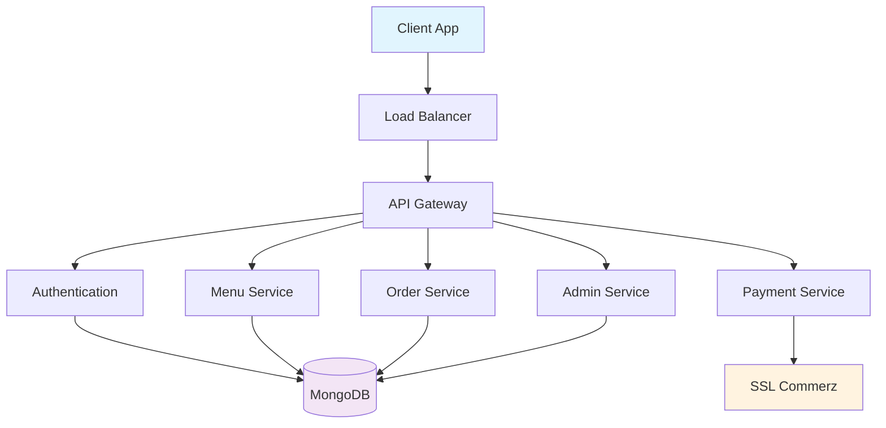
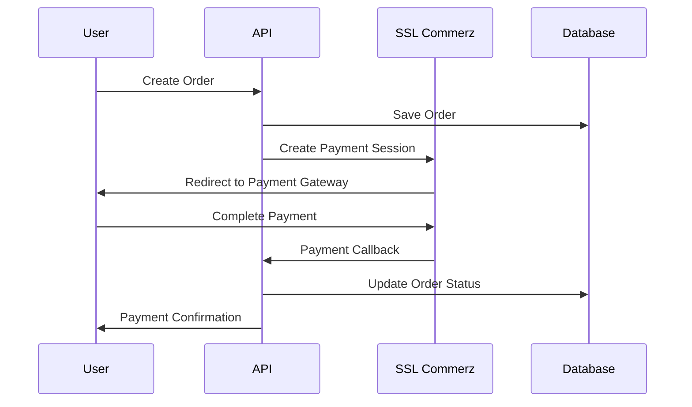

# 🍕 Bistro Boss Server

<div align="center">


**A comprehensive, production-ready food delivery API with advanced payment integration, real-time order management, and scalable architecture.**

[🚀 Live Demo](https://bistro-boss-server-tau-three.vercel.app) • [📚 API Docs](#-api-documentation) • [🛠️ Tech Stack](#-tech-stack) • [📦 Installation](#-installation)

</div>

---

## 🌟 **Project Highlights**

| Feature | Description | Status |
|---------|-------------|--------|
| 🔐 **Authentication** | JWT-based auth with role-based access control | ✅ Complete |
| 💳 **Payment Gateway** | SSL Commerz integration with webhook handling | ✅ Complete |
| 📦 **Order Management** | Real-time order tracking & status updates | ✅ Complete |
| 🛒 **Shopping Cart** | Persistent cart with item management | ✅ Complete |
| 📊 **Admin Dashboard** | Dynamic configuration & analytics | ✅ Complete |
| 🚚 **Shipping System** | Multi-zone shipping with cost calculation | ✅ Complete |
| 🔧 **Maintenance Mode** | Zero-downtime maintenance capability | ✅ Complete |
| 📱 **RESTful API** | 20+ endpoints with comprehensive CRUD | ✅ Complete |

---

## 🚀 **Live Demo & Quick Start**

<div align="center">

### **🌐 Production API**
**Base URL:** `https://bistro-boss-server-tau-three.vercel.app`

[](https://bistro-boss-server-tau-three.vercel.app)

### **📱 Quick API Test**
```bash
# Test the live API
curl https://bistro-boss-server-tau-three.vercel.app/api/v1/menus
```

</div>

---

## 🛠️ **Tech Stack & Architecture**

<div align="center">

### **Backend Technologies**


### **Security & Performance**


### **Payment & Deployment**


</div>

---

## 📊 **System Architecture**



---

## 🚀 **Features Overview**

### **🔐 Authentication & Authorization**
- **JWT-based authentication** with refresh tokens
- **Role-based access control** (User, Chef, Admin)
- **Secure password hashing** with bcrypt
- **Token validation middleware**

### **🍽️ Menu Management System**
- **CRUD operations** for menu items
- **Category management** with nested structures
- **Image handling** with cloud storage
- **Search and filtering** capabilities
- **Chef-specific menu management**

### **💳 Payment Integration**
- **SSL Commerz payment gateway** integration
- **Secure payment processing** with webhooks
- **Transaction verification** and validation
- **Refund processing** capabilities
- **Payment status tracking**

### **📦 Order Management**
- **Real-time order tracking** with status updates
- **Order history** and analytics
- **Email notifications** for order updates
- **Order cancellation** with refund processing
- **Delivery time estimation**

### **🛒 Shopping Cart System**
- **Persistent cart** across sessions
- **Item quantity management**
- **Price calculation** with discounts
- **Cart synchronization** across devices

### **⚙️ Admin Configuration**
- **Dynamic SSL Commerz settings** management
- **Payment collection** phone number updates
- **Site configuration** from dashboard
- **Maintenance mode** control
- **Analytics and reporting**

---

## 📦 **Installation & Setup**

### **Prerequisites**
- Node.js 18+ 
- MongoDB Atlas account
- SSL Commerz merchant account

### **Quick Installation**

```bash
# Clone the repository
git clone https://github.com/parvejme24/bistro-boss-server.git
cd bistro-boss-server

# Install dependencies
npm install

# Set up environment variables
cp env.example .env

# Start development server
npm run dev
```

### **Environment Configuration**

```env
# Database Configuration
DB_USER=your_mongodb_username
DB_PASS=your_mongodb_password
DB_NAME=bistro_boss

# JWT Configuration
JWT_SECRET=your-super-secret-jwt-key-here-make-it-long-and-random
JWT_REFRESH_SECRET=your-refresh-secret-key

# Server Configuration
PORT=5000
NODE_ENV=development

# SSL Commerz Configuration
SSL_COMMERZ_STORE_ID=testbox
SSL_COMMERZ_STORE_PASSWORD=qwerty
SSL_COMMERZ_IS_LIVE=false

# Application URLs
FRONTEND_URL=http://localhost:3000
BACKEND_URL=http://localhost:5000
```

---

## 🚀 **Deployment**

### **Vercel Deployment (Recommended)**

```bash
# Install Vercel CLI
npm install -g vercel

# Login to Vercel
vercel login

# Deploy to production
vercel --prod
```

### **Environment Variables in Vercel**

Set these environment variables in your Vercel dashboard:

```env
DB_USER=your_mongodb_username
DB_PASS=your_mongodb_password
DB_NAME=bistro_boss
JWT_SECRET=your-super-secret-jwt-key
JWT_REFRESH_SECRET=your-refresh-secret-key
SSL_COMMERZ_STORE_ID=testbox
SSL_COMMERZ_STORE_PASSWORD=qwerty
SSL_COMMERZ_IS_LIVE=false
```

---

## 📚 **API Documentation**

### **Base URL:** `https://bistro-boss-server-tau-three.vercel.app/api/v1`

### **🔐 Authentication Endpoints**

| Method | Endpoint | Description | Auth Required |
|--------|----------|-------------|---------------|
| `POST` | `/auth/register` | User registration | ❌ |
| `POST` | `/auth/login` | User login | ❌ |
| `POST` | `/auth/refresh-token` | Refresh JWT token | ✅ |

### **🍽️ Menu Endpoints**

| Method | Endpoint | Description | Auth Required |
|--------|----------|-------------|---------------|
| `GET` | `/menus` | Get all menus | ❌ |
| `GET` | `/menus/:id` | Get menu by ID | ❌ |
| `POST` | `/admin/menus` | Create menu (Admin) | ✅ |
| `PUT` | `/admin/menus/:id` | Update menu (Admin) | ✅ |
| `DELETE` | `/admin/menus/:id` | Delete menu (Admin) | ✅ |

### **📦 Order Endpoints**

| Method | Endpoint | Description | Auth Required |
|--------|----------|-------------|---------------|
| `POST` | `/orders` | Create order | ✅ |
| `GET` | `/orders` | Get user orders | ✅ |
| `GET` | `/orders/:id` | Get order by ID | ✅ |
| `PUT` | `/orders/:id/cancel` | Cancel order | ✅ |
| `GET` | `/admin/orders` | Get all orders (Admin) | ✅ |
| `PUT` | `/admin/orders/:id/status` | Update order status (Admin) | ✅ |

### **⚙️ Admin Configuration**

| Method | Endpoint | Description | Auth Required |
|--------|----------|-------------|---------------|
| `GET` | `/admin/config` | Get admin configuration | ✅ |
| `PUT` | `/admin/config/ssl-commerz` | Update SSL Commerz settings | ✅ |
| `PUT` | `/admin/config/payment-collection` | Update payment collection | ✅ |
| `POST` | `/admin/config/test-ssl-commerz` | Test SSL Commerz connection | ✅ |

---

## 🔐 **SSL Commerz Integration**

### **Payment Flow Architecture**



### **Callback URLs Configuration**

Configure these URLs in your SSL Commerz dashboard:

- **Success:** `https://bistro-boss-server-tau-three.vercel.app/api/v1/orders/payment/success`
- **Fail:** `https://bistro-boss-server-tau-three.vercel.app/api/v1/orders/payment/fail`
- **Cancel:** `https://bistro-boss-server-tau-three.vercel.app/api/v1/orders/payment/cancel`
- **IPN:** `https://bistro-boss-server-tau-three.vercel.app/api/v1/orders/payment/ipn`

---

## 🧪 **Testing**

### **API Testing**

```bash
# Test basic connectivity
curl https://bistro-boss-server-tau-three.vercel.app/

# Test menu endpoints
curl https://bistro-boss-server-tau-three.vercel.app/api/v1/menus

# Test with authentication
curl -H "Authorization: Bearer YOUR_TOKEN" \
     https://bistro-boss-server-tau-three.vercel.app/api/v1/orders
```

### **Local Testing**

```bash
# Start the server
npm run dev

# Run tests
npm test

# Test specific endpoints
curl http://localhost:5000/api/v1/menus
```

---

## 📊 **Database Schema**

### **Core Collections**

| Collection | Purpose | Key Features |
|------------|---------|--------------|
| **Users** | User accounts & authentication | JWT tokens, role-based access |
| **Menus** | Food items & categories | Image handling, pricing, categories |
| **Orders** | Order management & payment | Status tracking, payment integration |
| **Carts** | Shopping cart functionality | Persistent storage, item management |
| **Reviews** | User reviews & ratings | Rating system, moderation |
| **AdminConfig** | Admin configuration settings | Dynamic settings management |

---

## 🛡️ **Security Features**

<div align="center">


</div>

- **🔐 JWT Authentication** with secure token management
- **🛡️ Helmet Security Headers** for protection against common vulnerabilities
- **🔄 Rate Limiting** to prevent abuse and DDoS attacks
- **🌐 CORS Protection** for cross-origin request security
- **🧹 XSS Protection** with input sanitization
- **💉 MongoDB Injection Protection** with parameterized queries
- **🔒 Role-based Authorization** with granular permissions
- **🛡️ Input Validation** with comprehensive sanitization

---

## 📈 **Performance & Scalability**

- **⚡ Serverless Architecture** for automatic scaling
- **🗄️ MongoDB Atlas** for cloud database management
- **🔄 Connection Pooling** for optimal database performance
- **📦 Efficient Data Models** with proper indexing
- **🚀 CDN Integration** for static asset delivery
- **📊 Monitoring & Logging** for performance tracking

---

## 🤝 **Contributing**

We welcome contributions! Please follow these steps:

1. **Fork** the repository
2. **Create** a feature branch (`git checkout -b feature/AmazingFeature`)
3. **Commit** your changes (`git commit -m 'Add some AmazingFeature'`)
4. **Push** to the branch (`git push origin feature/AmazingFeature`)
5. **Open** a Pull Request

### **Development Guidelines**

- Follow **ESLint** configuration
- Write **comprehensive tests**
- Update **documentation** for new features
- Follow **conventional commit messages**

---

## 📄 **License**

This project is licensed under the **ISC License** - see the [LICENSE](LICENSE) file for details.

---

## 🆘 **Support & Contact**

<div align="center">

**Need help? Get in touch!**

[](mailto:support@bistroboss.com)
[](https://github.com/parvejme24/bistro-boss-server/issues)
[](https://linkedin.com/in/parvejme24)

</div>

---

<div align="center">

### **🍕 Bistro Boss Server**

**Delicious food delivery API with enterprise-grade security and payment processing!**

[](https://github.com/parvejme24/bistro-boss-server)

**Built with modern technologies for scalable, secure, and maintainable code.**

</div> 